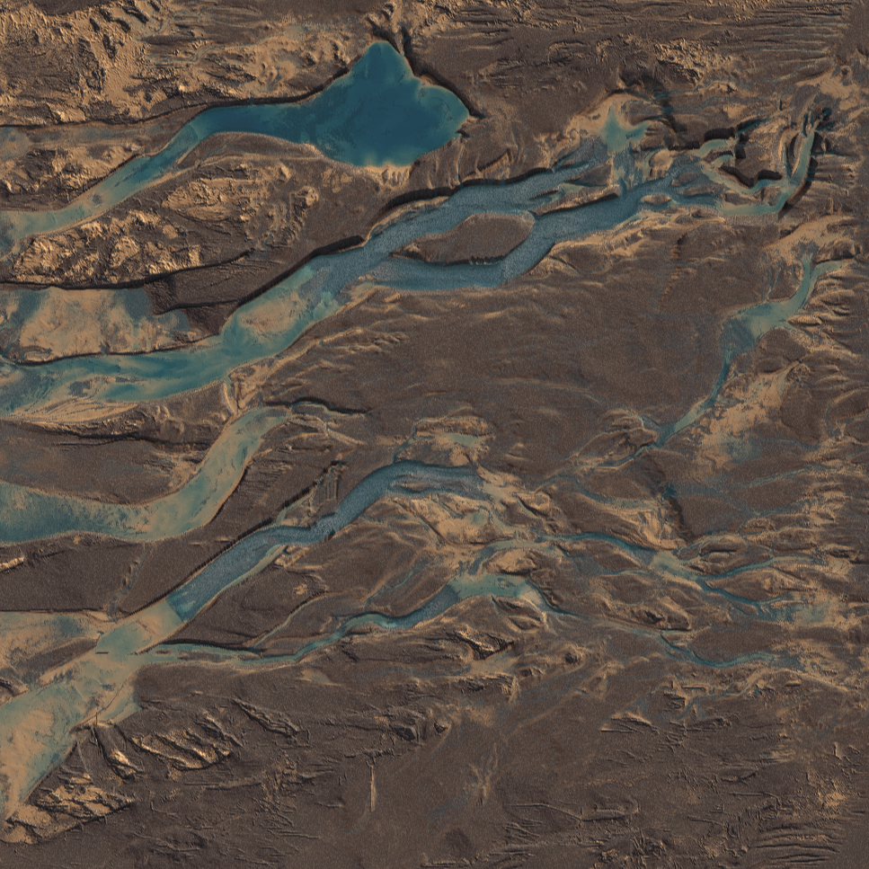
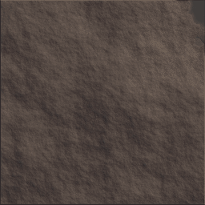
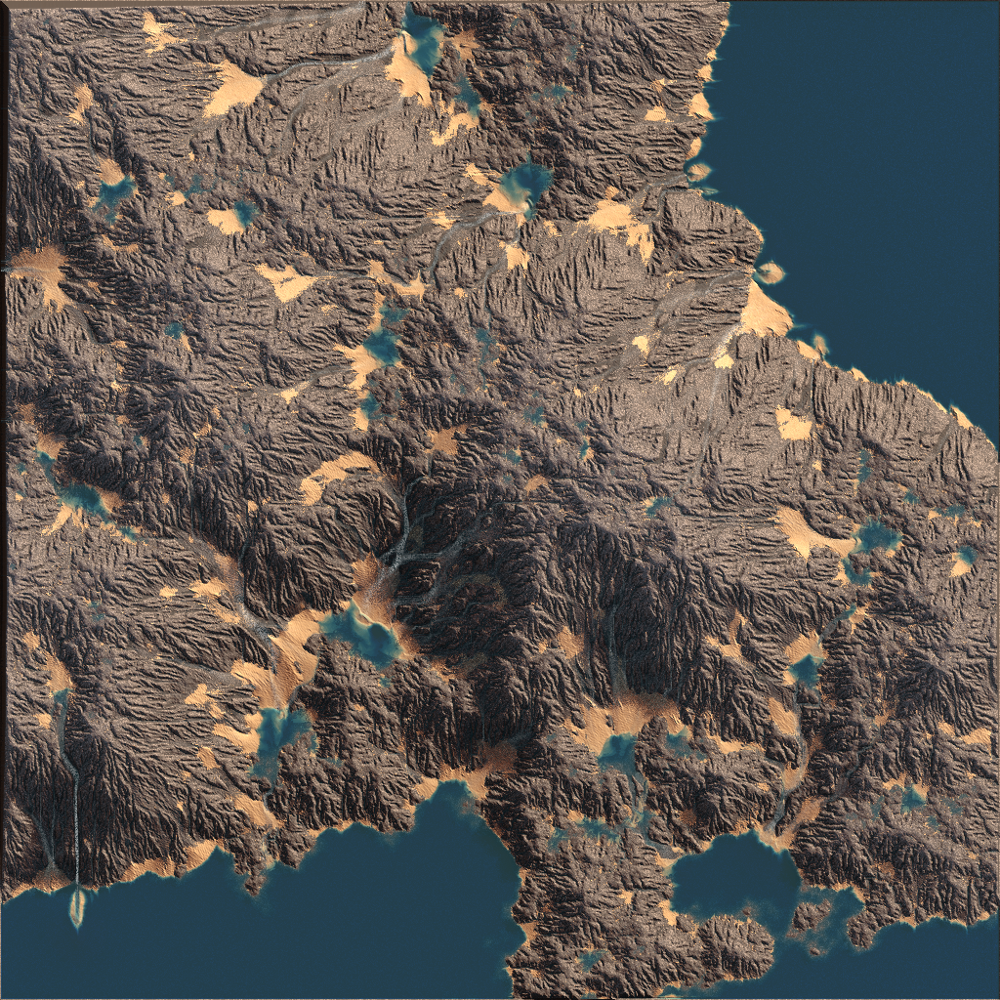
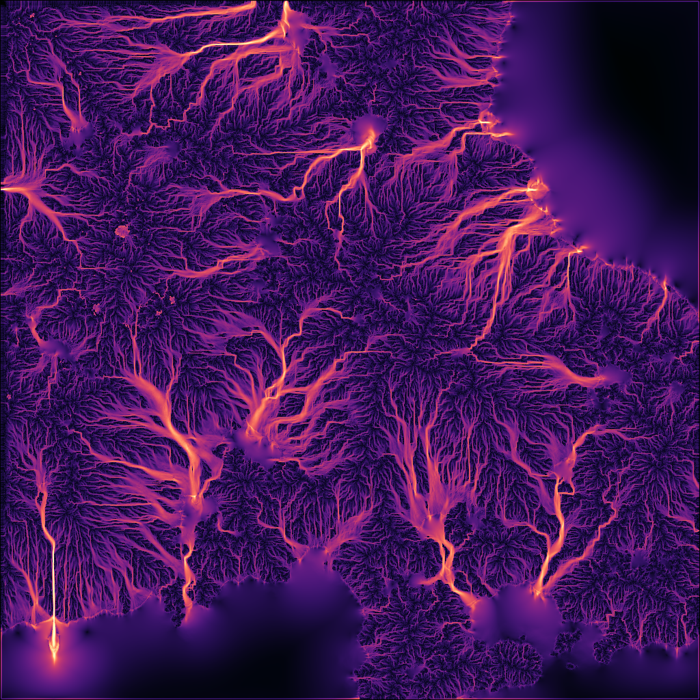

# Hydraulic Erosion Based Terrain Generation

     

Terrain is represented as 3 layers of heightmaps, with an additional heightmaps to represent the water level and amount of suspended sediment of each size.

Terrain is made up of 3 layers, with decreasing hardness and increasing carraying capacity:

- rock (bottom layer)
- gravel (middle layer)
- sand (top layer)

The layers are strictly ordered by size.

Each layer erodes into the next, except sand which erodes into itself. For example, when water passes over rock the height of the rock decreases, and the water layer gains the corresponding amount of suspended gravel.

The carrying capacity of the water depends on its volume and its velocity. This results in material being eroded as water runs down slopes, and deposited when the water settles in basins.

The simulation is done on the GPU in openGL 4.6 compute shaders

### Problems

Loses eroded/deposited height over time due to a bug

Performance is poor. For example, it takes minutes to erode a 1024x heightmap with an RTX 3050 ti laptop GPU.

The end result does not look very much like eroded terrain

### 3rd Party Libraries

- [glad](https://glad.dav1d.de/)
    - OpenGL 4.6 loader
- [GLFW](https://www.glfw.org/)
    - Cross platform input and windowing
- [glm](https://github.com/g-truc/glm)
    - Vector and matrix math
- [Dear ImGui](https://github.com/ocornut/imgui)
    - UI
- [gif.h](https://github.com/charlietangora/gif-h)
    - Write gif files from raw pixel data
- [stb_image.h](https://github.com/nothings/stb/blob/master/stb_image.h)
    - Read image formats into raw pixel data

### Files

- graphics/shader (cpp/h)
    - Shader class and helper functions
    - Supports hot reloading
- graphics/texture (cpp/h)
    - Texture class and helper functions
- main.cpp
    - Open window and set up GPU resources
    - Simple camera controller
    - Main render loop with configurable simulation steps per frame

- resources/shaders/2dheioghtmapvis.frag
    - Visualizes the current state of the simulation in 2D with shading and AO
- resources/shaders/erosionMapRaymarcher.frag
    - Visualizes the current state of the simulation in 3D with raymarching
- heightmaperosioncommon.glsl
    - Included in all other shaders
    - Helper functions and structs
    - Buffer and uniform declarations
- random.glsl
    - Included in all other shaders
    - Hash functions and a random number generator with global state
- initializeHeightmap.comp
    - Initializes the heightmap to fractal noise
- resources/shaders/calcWaterOutHeightmap.comp
    - Calculates the amount of water leaving each tile this iteration
- resources/shaders/erodeHeightmap.comp
    - Runs after calcWaterOutHeightmap.comp, and uses the results to calculate the height, momentum, and sediment levels of the water in each tile.
    - Erodes / depoisits based on the amount and velocity of the water

